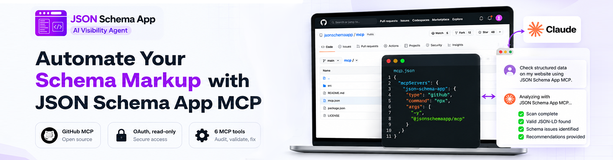
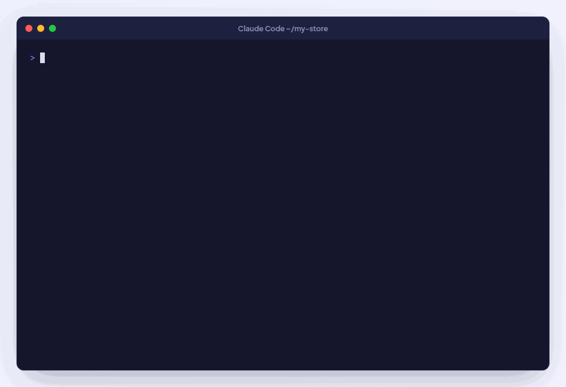
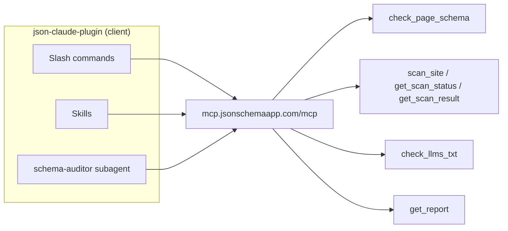
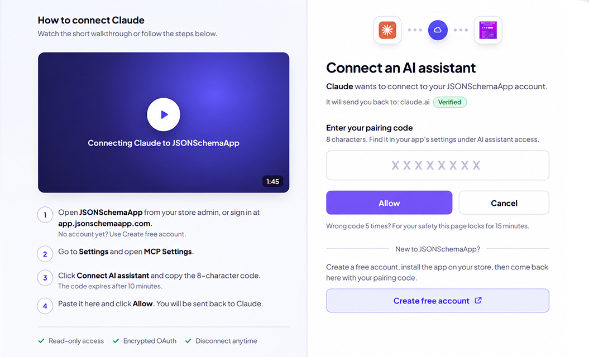
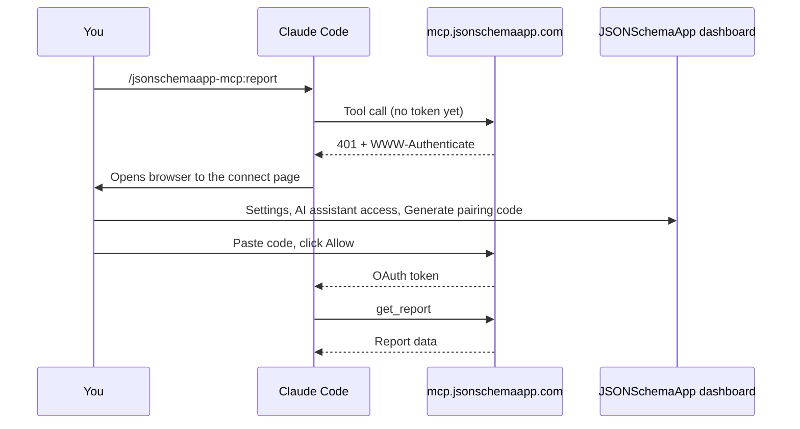
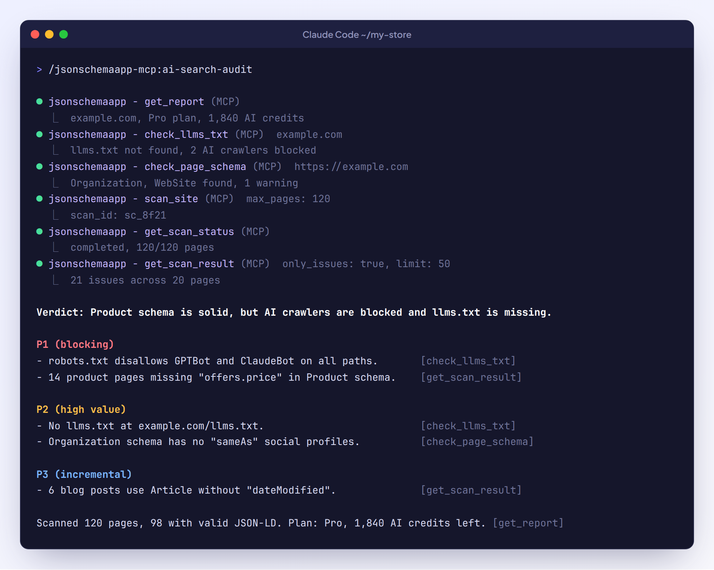

<!-- Image pending: add the file under docs/images/ then uncomment this block.
<p align="center">
  
</p>
-->

# JSON Schema App MCP: Claude Code Plugin

<p>
  
  
  
  
</p>

Connects Claude to the **JSON Schema App MCP server** (`https://mcp.jsonschemaapp.com/mcp`) so you can check structured data (JSON-LD / Schema.org), scan your site, audit AI-crawler access, and read your structured-data report, right from Claude.

This plugin is a **client**: it only connects to the hosted MCP server. It does not change or redeploy any server code, so nothing in the existing MCP/app flow is affected.

## Quick start

```
/plugin marketplace add MakkPresstech/json-claude-plugin
/plugin install jsonschemaapp-mcp@jsonschemaapp
/jsonschemaapp-mcp:report
```

The first command that calls a tool opens the connect page in your browser. See [First connection](#first-connection).

<!-- Image pending: add the file under docs/images/ then uncomment this block.
<p align="center">
  
</p>
-->

## Contents

- [What's inside](#whats-inside)
- [MCP tools exposed by the server](#mcp-tools-exposed-by-the-server)
- [First connection](#first-connection)
- [Authentication](#authentication)
- [Install](#install)
- [Fewer permission prompts](#fewer-permission-prompts)
- [Usage](#usage)
- [Example output](#example-output)
- [Skills (model-invoked)](#skills-model-invoked)
- [Consistent, grounded audits](#consistent-grounded-audits)
- [Troubleshooting](#troubleshooting)
- [Note on FAQPage / HowTo](#note-on-faqpage--howto)

## What's inside

```
json-claude-plugin/
├── .claude-plugin/
│   ├── plugin.json              # Plugin manifest
│   └── marketplace.json         # Marketplace entry so it installs via /plugin
├── .mcp.json                    # Connects to https://mcp.jsonschemaapp.com/mcp (OAuth)
├── commands/                    # Slash commands (one per workflow)
│   ├── check-page.md            # /jsonschemaapp-mcp:check-page   -> check_page_schema
│   ├── scan-site.md             # /jsonschemaapp-mcp:scan-site    -> scan_site + status + result
│   ├── report.md                # /jsonschemaapp-mcp:report       -> get_report
│   ├── check-llms.md            # /jsonschemaapp-mcp:check-llms   -> check_llms_txt
│   └── ai-search-audit.md       # /jsonschemaapp-mcp:ai-search-audit (full audit, all tools)
├── agents/
│   └── schema-auditor.md        # Subagent that drives a full audit end to end
├── skills/                      # Model-invoked skills (auto-activate from natural language)
│   ├── structured-data-audit/   # Full audit workflow over the MCP tools
│   ├── schema-rich-results/     # Which Schema.org types earn rich results (FAQPage/HowTo rule)
│   ├── ai-search-optimization/  # llms.txt + AI-crawler access via check_llms_txt
│   ├── draft-llms-txt/          # Draft a valid llms.txt from scan data (client-side)
│   ├── ai-crawler-access/       # robots.txt snippets to allow AI crawlers (any platform)
│   └── audit-report-format/     # Canonical report shape (verdict + P1/P2/P3 + tool citations)
├── hooks/
│   ├── hooks.json               # SessionStart connectivity reminder
│   └── connectivity-check.sh    # Non-blocking "connect the server first" notice
├── icon.png                     # Plugin icon for the directory listing
├── LICENSE                      # MIT
└── README.md
```

### How the pieces fit together



## MCP tools exposed by the server

| Tool | What it does |
|------|--------------|
| `check_page_schema` | Structured data of one public page (any URL). 10/min. |
| `scan_site` | Start a background scan of your own site; returns a `scan_id`. |
| `get_scan_status` | Poll a scan's progress by `scan_id`. |
| `get_scan_result` | Per-page findings + site totals for a completed scan. |
| `check_llms_txt` | `llms.txt` / `llms-full.txt` validity + AI-crawler robots.txt check. 10/min. |
| `get_report` | Combined report: domain, plan/limits, AI credits, latest scans. |

> Webflow tenants also get server-side starter prompts (`optimize_for_ai_search`,
> `fix_ai_crawler_access`, `check_schema_coverage`, `assign_schema_template`) which
> surface automatically in Claude's prompt picker when connected as a Webflow store.

## First connection

You need a JSONSchemaApp account and a pairing code. No account yet?
[Create one free](https://app.jsonschemaapp.com/register.php), install the app on your store, then continue below.

1. In Claude Code, run any command, for example `/jsonschemaapp-mcp:report`. Your browser opens the **Connect an AI assistant** page.
2. In another tab, open JSONSchemaApp from your store admin (or sign in at `app.jsonschemaapp.com`), go to **Settings**, then **AI assistant access**, and click **Generate pairing code**.
3. Copy the 8-character code, paste it on the connect page and click **Allow**. You are sent back to Claude and the command continues.

<!-- Image pending: add the file under docs/images/ then uncomment this block.
<p align="center">
  
</p>
-->

The connection is read-only: Claude can read your schema reports and scan results but cannot change your store. Disconnect anytime from **Settings**, **AI assistant access**.



## Authentication

The plugin's only built-in auth path is OAuth. There is nothing to configure in the plugin itself; the only manual step is the pairing code above.

`.mcp.json` points at the HTTP endpoint with no credentials, so on first use Claude
discovers the OAuth flow automatically (via the server's `401` + `WWW-Authenticate` and
`/.well-known/oauth-protected-resource`) and prompts you to connect.

### Using an API key instead

If you prefer a `jsa_live_...` key, add your own user-scope MCP server alongside the
plugin. The plugin does not ship a key option, because Claude Code disables OAuth
fallback for any server whose config sets an `Authorization` header, which would take
the OAuth path away from everyone who does not use a key.

```bash
claude mcp add --scope user --transport http -H "Authorization: Bearer YOUR_API_KEY" jsonschemaapp-key https://mcp.jsonschemaapp.com/mcp
```

Replace `YOUR_API_KEY` with your own key. Two things to note:

- **Pick a server name other than `jsonschemaapp`.** The example uses
  `jsonschemaapp-key`. Reusing the plugin's own server name shadows it, and you then get
  confusing connection errors because both entries claim the same name.
- Your key lives in your personal Claude Code config, not in this repository. Keep it
  out of version control, and revoke it in your dashboard under Settings if it leaks.

With a key configured this way, disable the plugin's own server in `/mcp` so you are not
connected twice.

## Install

**Via marketplace (recommended).** This directory ships a `.claude-plugin/marketplace.json`,
so it installs with `/plugin`:

```
/plugin marketplace add MakkPresstech/json-claude-plugin
/plugin install jsonschemaapp-mcp@jsonschemaapp
```

**Local dev.** Load the directory directly without a marketplace:

```bash
git clone https://github.com/MakkPresstech/json-claude-plugin.git
claude --plugin-dir ./json-claude-plugin
```

Verify the connection with `/mcp` (the server lists as
`plugin:jsonschemaapp-mcp:jsonschemaapp` when installed as a plugin),
then run `/jsonschemaapp-mcp:report` to confirm the tools respond. On session start the
plugin's connectivity hook prints a short reminder to complete OAuth first. See
[Fewer permission prompts](#fewer-permission-prompts).

## Fewer permission prompts

Each `mcp__plugin_jsonschemaapp-mcp_jsonschemaapp__*` tool call prompts for approval by
default. To let the six read-only tools run without interruption, add them to your **project** `.claude/settings.json`
(or user settings). Nothing here changes the server. It only pre-approves client-side
tool calls you'd otherwise approve by hand:

```json
{
  "permissions": {
    "allow": [
      "mcp__plugin_jsonschemaapp-mcp_jsonschemaapp__check_page_schema",
      "mcp__plugin_jsonschemaapp-mcp_jsonschemaapp__scan_site",
      "mcp__plugin_jsonschemaapp-mcp_jsonschemaapp__get_scan_status",
      "mcp__plugin_jsonschemaapp-mcp_jsonschemaapp__get_scan_result",
      "mcp__plugin_jsonschemaapp-mcp_jsonschemaapp__check_llms_txt",
      "mcp__plugin_jsonschemaapp-mcp_jsonschemaapp__get_report"
    ]
  }
}
```

## Usage

```
/jsonschemaapp-mcp:report                       # current state of your store
/jsonschemaapp-mcp:scan-site 200                # scan up to 200 pages, then summarize
/jsonschemaapp-mcp:check-page https://site/x     # check one page's structured data
/jsonschemaapp-mcp:check-llms example.com        # llms.txt + AI-crawler access
/jsonschemaapp-mcp:ai-search-audit               # full readiness audit
```

Or just ask in natural language (e.g. "audit my store's structured data") and the
`schema-auditor` subagent will drive the tools for you.

## Example output

A shortened `/jsonschemaapp-mcp:ai-search-audit` result for a sample store:

```
Verdict: Product schema is solid, but AI crawlers are blocked and llms.txt is missing.

P1 (blocking)
- robots.txt disallows GPTBot and ClaudeBot on all paths.          [check_llms_txt]
- 14 product pages missing "offers.price" in Product schema.        [get_scan_result]

P2 (high value)
- No llms.txt at example.com/llms.txt.                              [check_llms_txt]
- Organization schema has no "sameAs" social profiles.              [check_page_schema]

P3 (incremental)
- 6 blog posts use Article without "dateModified".                  [get_scan_result]

Scanned 120 pages, 98 with valid JSON-LD. Plan: Pro, 1,840 AI credits left. [get_report]
```

<!-- Image pending: add the file under docs/images/ then uncomment this block.
<p align="center">
  
</p>
-->

## Skills (model-invoked)

Unlike the slash commands (which you trigger explicitly), the bundled **skills** load
automatically when your request matches their description. No command needed:

| Skill | Activates when you… |
|-------|---------------------|
| `structured-data-audit` | ask to audit/check/improve JSON-LD or Schema.org on your site or a page. |
| `schema-rich-results` | ask which schema types are worth it, what's required, or why FAQPage/HowTo stopped showing rich results. |
| `ai-search-optimization` | ask about AI search visibility, GEO, `llms.txt`, or whether AI crawlers can reach your site. |
| `draft-llms-txt` | ask to write/generate an `llms.txt` or `llms-full.txt`. Drafts a valid file from scan data (the server only *checks* llms.txt). |
| `ai-crawler-access` | ask to unblock GPTBot/ClaudeBot/PerplexityBot etc. Gives copy-paste `robots.txt` snippets for any platform (not just Webflow). |
| `audit-report-format` | reference used whenever results are reported. Defines the one-line-verdict + P1/P2/P3 + tool-citation shape so every audit reads the same. |

They carry the same workflow and rules as the commands/subagent (including the
FAQPage/HowTo rich-result rule) so behavior stays consistent however you invoke it.

## Consistent, grounded audits

So every audit reads the same way and stays efficient, the commands, subagent, and
skills share three conventions (all client-side prompt guidance, no server change):

- **Standard report format.** Every answer leads with a one-line verdict, then findings
  grouped **P1 (blocking)** → **P2 (high value)** → **P3 (incremental)**, each citing the
  tool that produced it. Defined once in the `audit-report-format` skill. Findings must
  trace to real tool output, with no invented scores or errors.
- **Poll backoff for scans.** After `scan_site`, `get_scan_status` is polled with a
  backoff (first poll ~5s, then 5s → 10s → 20s → 30s, ~30s thereafter) instead of a tight
  loop.
- **Pagination discipline.** `get_scan_result` is read with `only_issues: true` and
  `limit: 50`, paging via `offset`, so large scans don't flood context; the full
  inventory (`only_issues: false`) is pulled only when actually needed.

## Troubleshooting

| Problem | Fix |
|---------|-----|
| `/mcp` shows `plugin:jsonschemaapp-mcp:jsonschemaapp` as not connected | Run any plugin command to start OAuth, or select the server in `/mcp` and choose authenticate. |
| The connect page says the code is invalid | Codes expire. Generate a fresh one under **Settings**, **AI assistant access** and paste it within a few minutes. |
| The connect page is locked | 5 wrong codes lock the page for 15 minutes. Wait, then use a newly generated code. |
| Confusing connection errors after adding an API key | Your key server reuses the name `jsonschemaapp`. Remove it and re-add it as `jsonschemaapp-key`. |
| Tools suddenly return 401 | The connection was revoked or expired. Reconnect through `/mcp` and enter a new pairing code. |
| `check_page_schema` or `check_llms_txt` returns a rate-limit error | These tools allow 10 calls per minute. Wait a minute and retry. |
| Every tool call asks for approval | Add the allow list from [Fewer permission prompts](#fewer-permission-prompts). |

## Note on FAQPage / HowTo

FAQPage and HowTo markup no longer produce Google rich results. The tools report them
at the `ai_readability` level (useful for AI assistants). The commands and the subagent
are instructed never to recommend them as Google rich-result wins.
